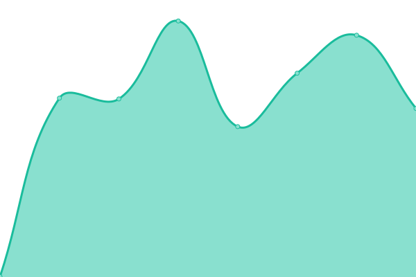

# [📈 Live Status](https://status.caturra.social): <!--live status--> **🟧 Partial outage**

This repository contains the open-source uptime monitor and status page for [Caturra.Social](https://caturra.social/), powered by [Upptime](https://github.com/upptime/upptime).

With [Upptime](https://upptime.js.org), you can get your own unlimited and free uptime monitor and status page, powered entirely by a GitHub repository. We use [Issues](https://github.com/CaturraSocial/upptime/issues) as incident reports, [Actions](https://github.com/CaturraSocial/upptime/actions) as uptime monitors, and [Pages](https://status.caturra.social) for the status page.

<!--start: status pages-->
<!-- This summary is generated by Upptime (https://github.com/upptime/upptime) -->
<!-- Do not edit this manually, your changes will be overwritten -->
<!-- prettier-ignore -->
| URL | Status | History | Response Time | Uptime |
| --- | ------ | ------- | ------------- | ------ |
|  [Site](https://caturra.app) | 🟩 Up | [site.yml](https://github.com/CaturraSocial/upptime/commits/HEAD/history/site.yml) | 

 819ms
     
 | 

<a href="https://status.caturra.app/history/site">100.00%</a>
    

|  [API Live](https://caturra.app/api/v1/ping) | 🟩 Up | [api-live.yml](https://github.com/CaturraSocial/upptime/commits/HEAD/history/api-live.yml) | 

 725ms
     
 | 

<a href="https://status.caturra.app/history/api-live">100.00%</a>
    

|  [Dev](https://dev.caturra.app) | 🟥 Down | [dev.yml](https://github.com/CaturraSocial/upptime/commits/HEAD/history/dev.yml) | 

 655ms
     
 | 

<a href="https://status.caturra.app/history/dev">100.00%</a>
    

|  [API Dev](https://dev.caturra.app/api/v1/ping) | 🟥 Down | [api-dev.yml](https://github.com/CaturraSocial/upptime/commits/HEAD/history/api-dev.yml) | 

 158ms
     
 | 

<a href="https://status.caturra.app/history/api-dev">100.00%</a>
    

|  [Bengal](https://caturra.social) | 🟩 Up | [bengal.yml](https://github.com/CaturraSocial/upptime/commits/HEAD/history/bengal.yml) | 

 770ms
     
 | 

<a href="https://status.caturra.app/history/bengal">100.00%</a>
    

|  [Sphynx](https://sphynx.caturra.app) | 🟩 Up | [sphynx.yml](https://github.com/CaturraSocial/upptime/commits/HEAD/history/sphynx.yml) | 

 522ms
     
 | 

<a href="https://status.caturra.app/history/sphynx">100.00%</a>
    

<!--end: status pages-->

[**Visit our status website →**](https://status.caturra.social)

## 📄 License

- Powered by: [Upptime](https://github.com/upptime/upptime)
- Code: [MIT](./LICENSE) © [Anand Chowdhary](https://anandchowdhary.com), supported by [Pabio](https://pabio.com)
- Data in the `./history` directory: [Open Database License](https://opendatacommons.org/licenses/odbl/1-0/)
